# คู่มือการใช้งานระบบรายงาน (Report System)
โครงการ PaiNamNae
เวอร์ชัน 1.0
อัปเดตล่าสุด: มีนาคม 2026

---

# 1. บทนำ

ระบบรายงาน (Report System) ถูกพัฒนาขึ้นเพื่อให้ผู้โดยสารสามารถแจ้งปัญหาเกี่ยวกับ:
- พฤติกรรมคนขับ
- ปัญหาเส้นทาง (Route)
- ปัญหาการจอง (Booking)
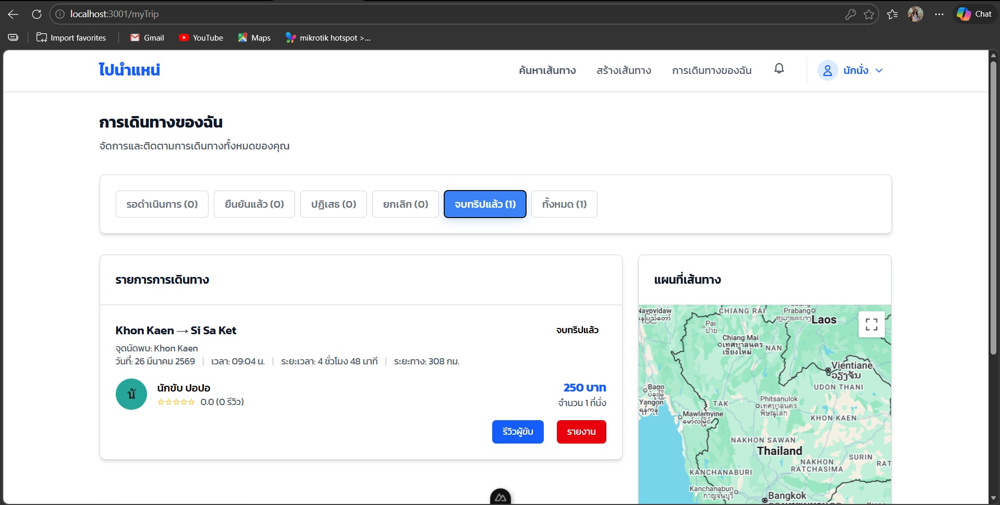
เมื่อผู้โดยสารส่งรายงาน ระบบจะ:
- สร้างเลขเคส (Case ID) แบบไม่ซ้ำ
- บันทึกข้อมูลลงฐานข้อมูล
- แสดงสถานะการดำเนินการ
- แจ้งเตือนเมื่อสถานะมีการเปลี่ยนแปลง
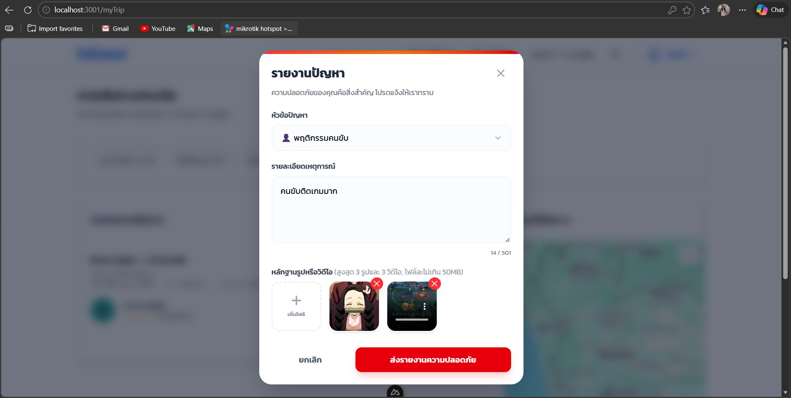
---

# 2. บทบาทผู้ใช้งาน

## 2.1 ผู้โดยสาร (Passenger)
สามารถ:
- ส่งรายงาน
- ดูรายการรายงานของตนเอง
- ติดตามสถานะเคส
- รับการแจ้งเตือนเมื่อสถานะเปลี่ยน
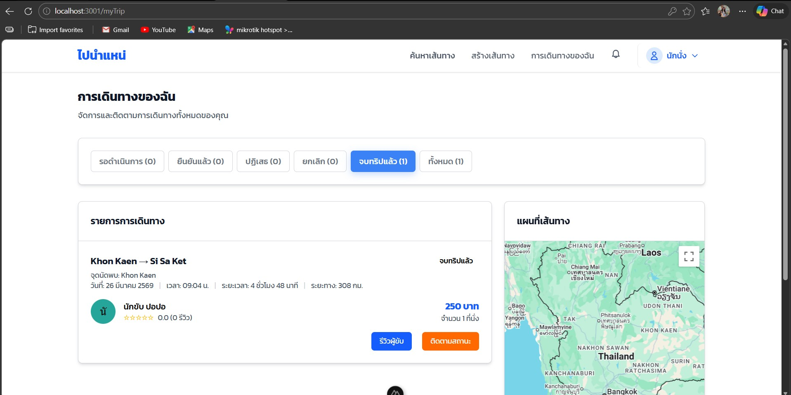
## 2.2 ผู้ดูแลระบบ (Admin)
สามารถ:
- ดูรายงานทั้งหมดในระบบ
- เปลี่ยนสถานะรายงาน
- เพิ่มหมายเหตุ
- ปิดเคส
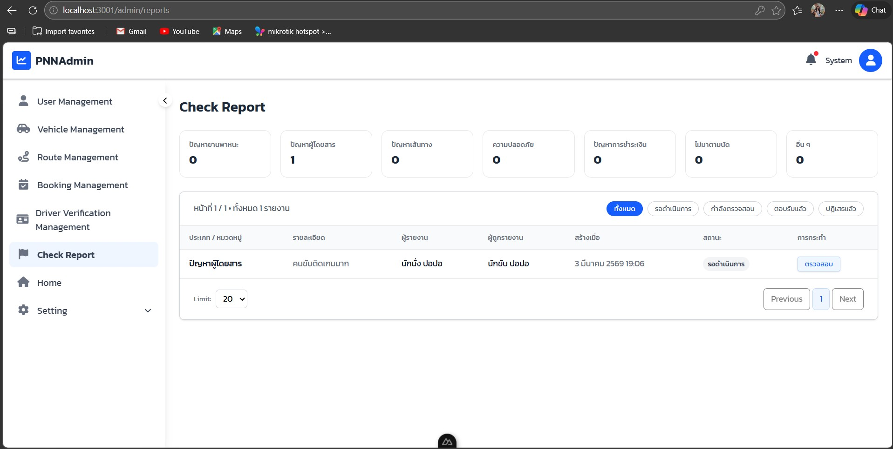
---

# 3. ขั้นตอนการส่งรายงาน (สำหรับผู้โดยสาร)

## 3.1 เข้าหน้าส่งรายงาน

1. ไปที่หน้า **My Trip**
2. กดปุ่ม **Report Driver**
3. ระบบจะแสดงฟอร์มรายงาน (Popup)

---

## 3.2 กรอกข้อมูลรายงาน

ข้อมูลที่จำเป็นต้องกรอก:

- ประเภทรายงาน (เช่น USER / ROUTE / BOOKING)
- หมวดหมู่ปัญหา (เช่น SCAM / HARASSMENT)
- รายละเอียดปัญหา
- แนบรูปภาพ (ถ้ามี)
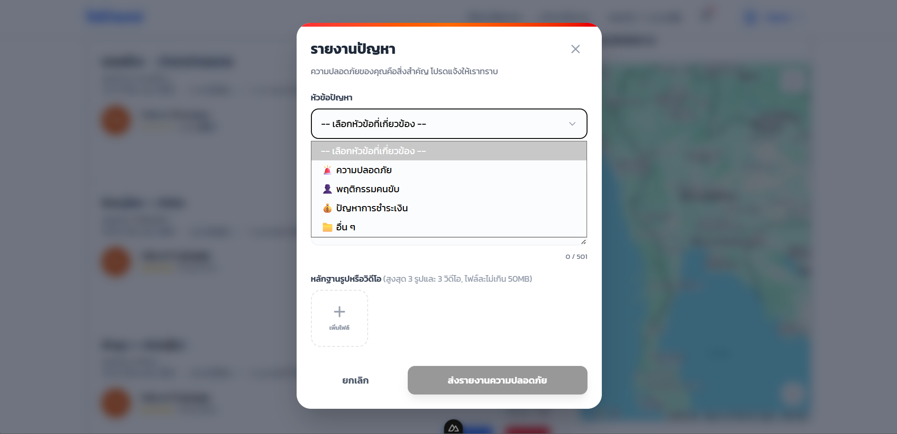
### การตรวจสอบข้อมูล (Validation)

หากกรอกข้อมูลไม่ครบ:
- ระบบจะแสดงข้อความแจ้งเตือน
- ไม่สามารถกดส่งได้
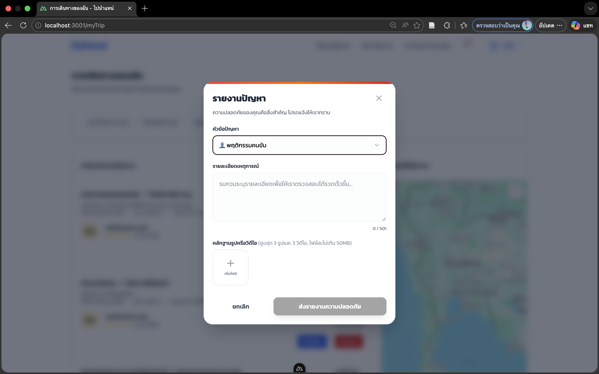
---

## 3.3 หลังจากกดส่งรายงาน

ระบบจะ:
- สร้าง Case ID แบบ Unique
- กำหนดสถานะเริ่มต้นเป็น **PENDING**
- แสดงข้อความยืนยันการส่งสำเร็จ
- บันทึกข้อมูลลงฐานข้อมูล
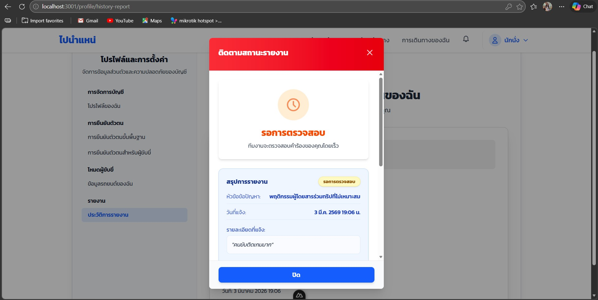
---

# 4. การดูรายการรายงานของตนเอง

## 4.1 เข้าหน้ารายงานของคุณ

1. ไปที่หน้า Profile
2. เลือกเมนู **My Reports**
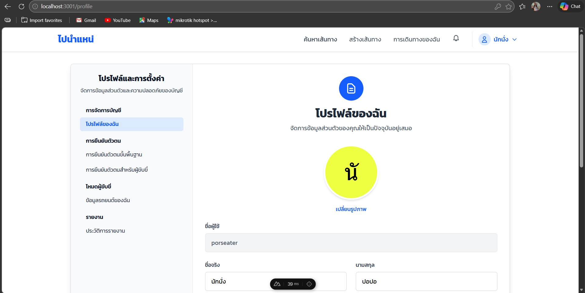

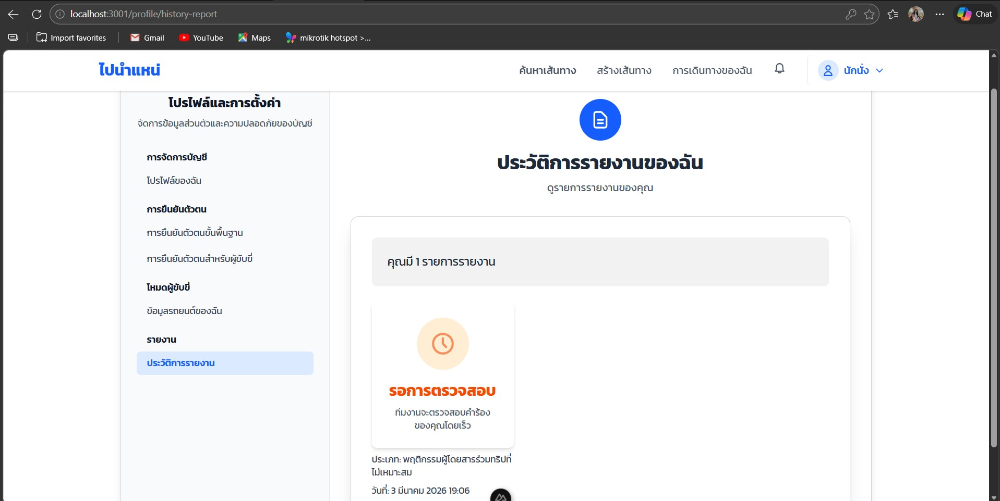
---

## 4.2 หน้ารายการรายงาน

ระบบจะแสดงข้อมูลแบบการ์ด ประกอบด้วย:

- ชื่อคนขับ
- วันที่รายงาน
- ประเภทรายงาน
- สถานะปัจจุบัน

สถานะที่เป็นไปได้:
- PENDING (รอดำเนินการ)
- INVESTIGATING (กำลังตรวจสอบ)
- RESOLVED (เสร็จสิ้น)
- REJECTED (ปฏิเสธ)
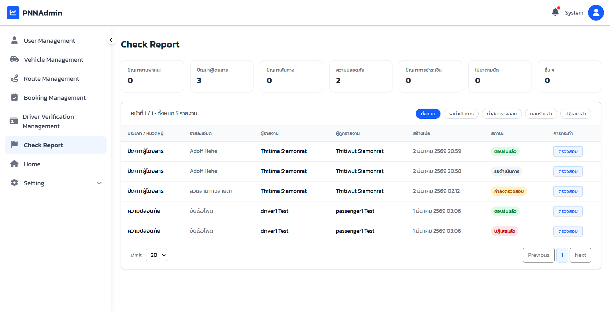
---

## 4.3 ดูรายละเอียดรายงาน

กดปุ่ม **ดูรายละเอียด (View Details)**

จะแสดงข้อมูล:

- Case ID
- ชื่อคนขับ
- ข้อมูลทริป
- ประเภทรายงาน
- หมวดหมู่ปัญหา
- รายละเอียดที่ผู้โดยสารแจ้ง
- รูปภาพ/วิดีโอแนบ
- สถานะล่าสุด
- หมายเหตุจาก Admin
- วันที่แก้ไข (ถ้ามี)
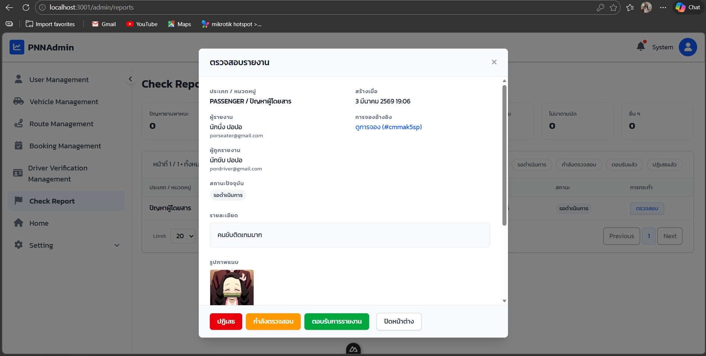
---

# 5. ระบบแจ้งเตือน (Notification)

เมื่อ:
- Admin เปลี่ยนสถานะรายงาน
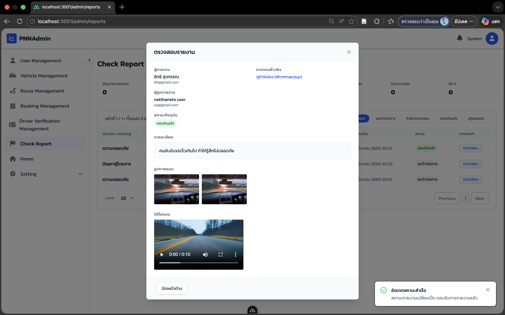
ระบบจะ:
- แสดง badge แจ้งเตือน
- อัปเดตสถานะล่าสุดให้ผู้โดยสาร
- แจ้งเตือนผ่านระบบ Notification
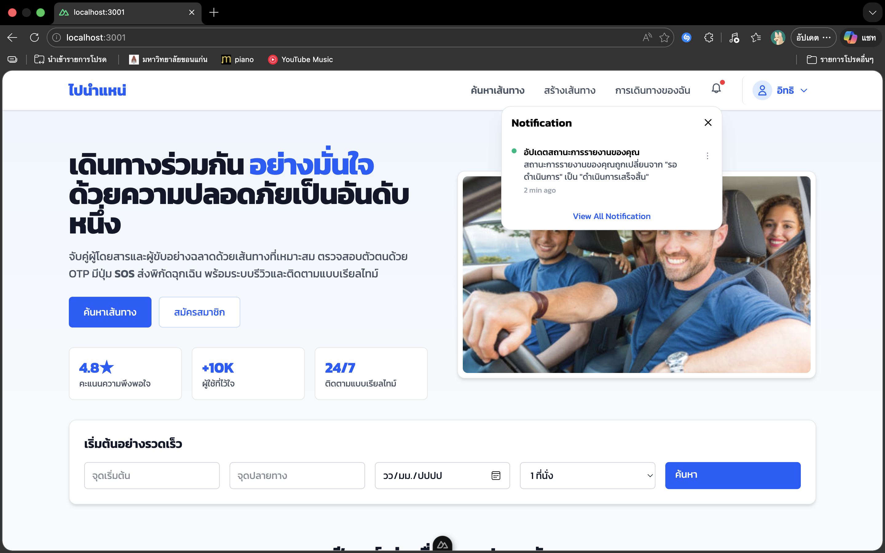 
---

# 6. การทำงานของผู้ดูแลระบบ (Admin)

## 6.1 ดูรายงานทั้งหมด

Admin สามารถ:
- ดูรายงานทุกเคส
- กรองตามสถานะ
- ดูรายละเอียดเต็มของแต่ละเคส

---

## 6.2 การอัปเดตสถานะ

Admin สามารถเปลี่ยนสถานะเป็น:

- INVESTIGATING
- RESOLVED
- REJECTED

ขั้นตอน:
1. เปิดดูรายงาน
2. เลือกสถานะใหม่
3. เพิ่มหมายเหตุ (ถ้ามี)
4. กดบันทึก

ระบบจะ:
- บันทึกวันที่แก้ไข (resolvedAt)
- บันทึกผู้ดำเนินการ (resolvedById)
- ส่งการแจ้งเตือนไปยังผู้โดยสาร
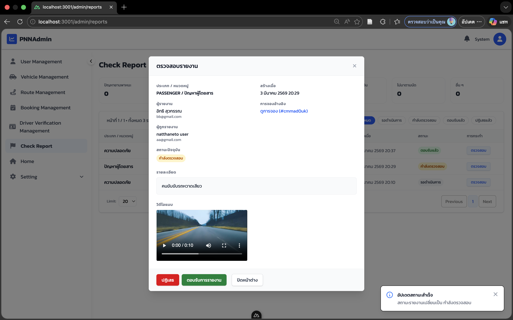
---

# 7. โครงสร้างฐานข้อมูล (Table: reports)

ประกอบด้วยฟิลด์:

- id (Primary Key)
- reporterId (ผู้แจ้ง)
- type (ประเภทหลัก)
- category (หมวดย่อย)
- status (ค่าเริ่มต้น PENDING)
- description (รายละเอียดปัญหา)
- images (เก็บ URL หลักฐาน)
- routeId (ถ้ามี)
- bookingId (ถ้ามี)
- targetUserId (ผู้ถูกแจ้ง)
- adminNotes (หมายเหตุจาก Admin)
- resolvedAt (วันที่แก้ไข)
- resolvedById (Admin ผู้ดำเนินการ)
- createdAt
- updatedAt

---

# 8. API ที่เกี่ยวข้อง

## 8.1 สร้างรายงาน
POST /reports

## 8.2 ดึงรายงานของผู้โดยสาร
GET /reports
GET /reports/{id}

## 8.3 อัปเดตสถานะ (Admin)
PATCH /reports/{id}/status

---

# 9. เงื่อนไขความถูกต้องของระบบ (Acceptance Criteria)

ระบบจะถือว่าทำงานถูกต้องเมื่อ:

- ผู้โดยสารส่งรายงานได้สำเร็จ
- ระบบไม่อนุญาตให้ส่งหากข้อมูลไม่ครบ
- ผู้โดยสารดูได้เฉพาะรายงานของตนเอง
- Admin สามารถเปลี่ยนสถานะได้
- เมื่อสถานะเปลี่ยน ผู้โดยสารได้รับแจ้งเตือน
- Case ID ไม่ซ้ำกัน

---

# 10. ปัญหาที่พบบ่อย (Troubleshooting)

ส่งรายงานไม่ได้:
- ตรวจสอบว่ากรอกข้อมูลครบทุกช่องที่จำเป็น

มองไม่เห็นรายงาน:
- ตรวจสอบว่าล็อกอินถูกต้อง
- ตรวจสอบว่าเป็นรายงานของตนเอง

สถานะไม่อัปเดต:
- รีเฟรชหน้า
- ตรวจสอบ Notification

---

# 11. บันทึกการเปลี่ยนแปลง (Change Log)

เวอร์ชัน 1.0
- เพิ่มระบบรายงาน
- เพิ่มระบบอัปเดตสถานะ
- เพิ่มระบบแจ้งเตือน

---

# 12. การประกาศการใช้ AI

เอกสารฉบับนี้มีการใช้เครื่องมือ AI ในการช่วยจัดรูปแบบเอกสาร 
โดยเนื้อหา การออกแบบ และการพัฒนาระบบดำเนินการโดยทีมผู้พัฒนาโครงการ