# คู่มือการใช้งานระบบรายงาน (Report System)
โครงการ ไปนำแหน่ (PaiNamNae)
เวอร์ชัน 1.0
อัปเดตล่าสุด: มีนาคม 2026

---

# 1. บทนำ

ระบบรายงาน (Report System) ถูกพัฒนาขึ้นเพื่อให้ผู้ใช้งานทั้งผู้ขับขี่และผู้โดยสารสามารถแจ้งปัญหาที่พบได้ 2 ช่องทาง ได้แก่:

**รายงานหลังจบทริป** — สำหรับผู้ขับขี่แจ้งปัญหาที่เกิดขึ้นระหว่างการเดินทาง เช่น:
- พฤติกรรมผู้โดยสาร
- ปัญหาเกี่ยวกับรถ
- ปัญหาเส้นทางการเดินทาง
- ความปลอดภัย
- การชำระเงิน
- อื่นๆ

**รายงานระบบ** — สำหรับผู้โดยสารและคนขับแจ้งปัญหาทั่วไปของระบบ เช่น:
- ปัญหาแอปพลิเคชัน
- ปัญหาบัญชีผู้ใช้
- ปัญหาเกี่ยวกับทริป
- ความปลอดภัย
- อื่นๆ

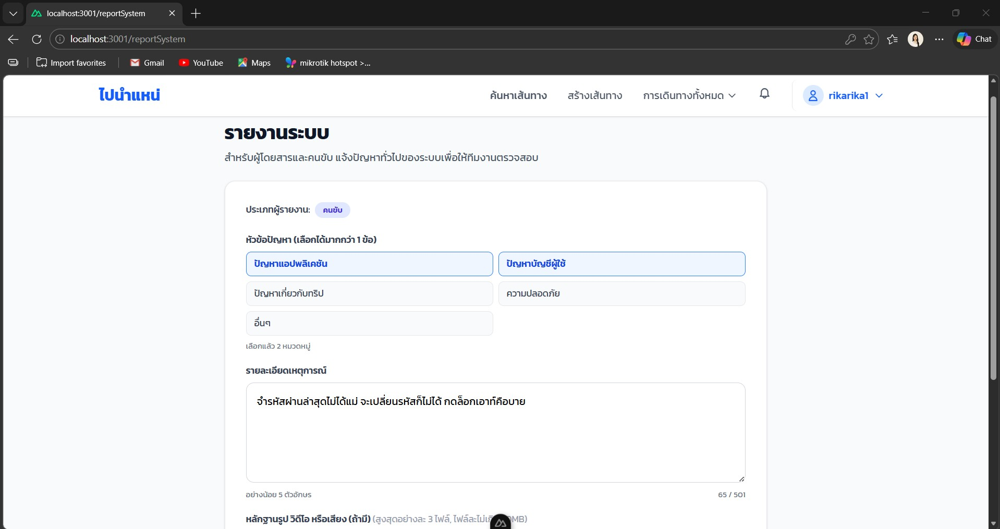

เมื่อผู้ใช้งานส่งรายงาน ระบบจะ:
- บันทึกข้อมูลรายงานและหลักฐานที่แนบ
- กำหนดสถานะเริ่มต้นเป็น **รอดำเนินการ**
- แสดงสถานะให้ผู้ใช้งานติดตามได้
- แจ้งผลการดำเนินการจากทีม Admin

---

# 2. บทบาทผู้ใช้งาน

## 2.1 ผู้ขับขี่ (Driver) และผู้โดยสาร (Passenger)
สามารถ:
- ส่งรายงานระบบ (`/reportSystem`) ได้ทุกเมื่อ
- ส่งรายงานหลังจบทริปจากหน้าคำขอจองเส้นทาง
- ดูประวัติการรายงานทั้งหมดของตนเอง
- ติดตามสถานะรายงานแบบละเอียด
- ดูผลการพิจารณาและหมายเหตุจาก Admin

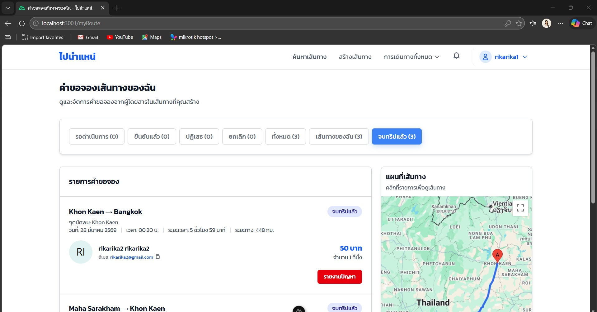

## 2.2 ผู้ดูแลระบบ (Admin)
สามารถ:
- ดูรายงานทั้งหมดในระบบพร้อมแดชบอร์ดสรุป
- กรองรายงานตามสถานะและประเภท
- ตรวจสอบรายละเอียด หลักฐาน รูปภาพ และวิดีโอ
- เพิ่มหมายเหตุตอบกลับผู้รายงาน
- อัปเดตสถานะรายงาน (ปฏิเสธ / กำลังตรวจสอบ / ตอบรับ)

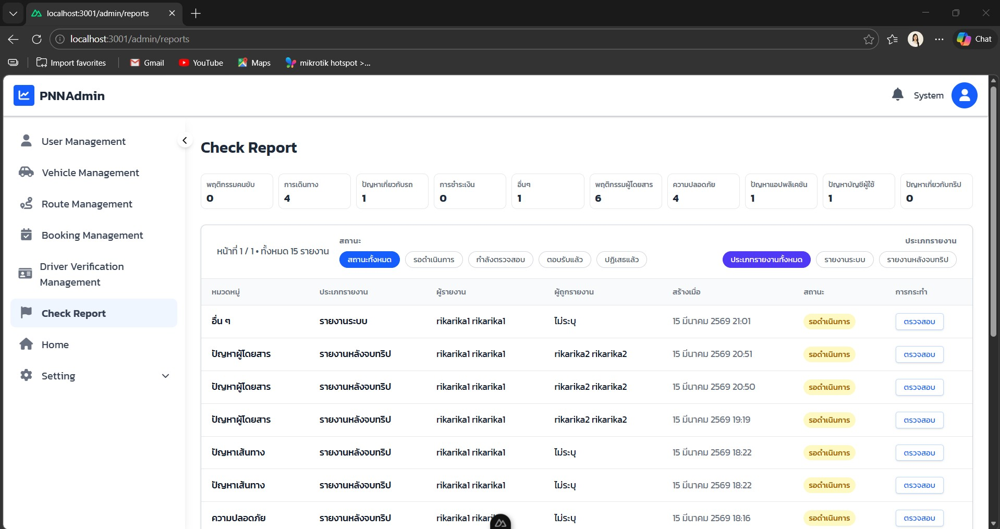

---

# 3. รายงานระบบ (System Report)

## 3.1 เข้าหน้ารายงานระบบ

1. ไปที่ URL `/reportSystem`
2. ระบบจะแสดงฟอร์มรายงานระบบแบบเต็มหน้า

---

## 3.2 กรอกข้อมูลรายงานระบบ

### ประเภทผู้รายงาน

ระบบจะแสดง **ประเภทผู้รายงาน** โดยอัตโนมัติตามบัญชีที่ล็อกอินอยู่ เช่น "คนขับ" หรือ "ผู้โดยสาร"

### หัวข้อปัญหา (เลือกได้มากกว่า 1 ข้อ)

- ปัญหาแอปพลิเคชัน
- ปัญหาบัญชีผู้ใช้
- ปัญหาเกี่ยวกับทริป
- ความปลอดภัย
- อื่นๆ

### รายละเอียดเหตุการณ์

อธิบายปัญหาในช่องข้อความ (อย่างน้อย 5 ตัวอักษร สูงสุด 501 ตัวอักษร)

### หลักฐานรูป วิดีโอ หรือเสียง (ถ้ามี)

กดปุ่ม "เพิ่มไฟล์" แนบได้สูงสุด 3 ไฟล์ ขนาดไม่เกิน 50MB ต่อไฟล์

### ลิงก์ (ถ้ามี)

กดปุ่ม "แนบลิงก์" แล้วกรอก URL ที่เกี่ยวข้อง กดอีกครั้งเพื่อ "ซ่อนช่องแนบลิงก์"

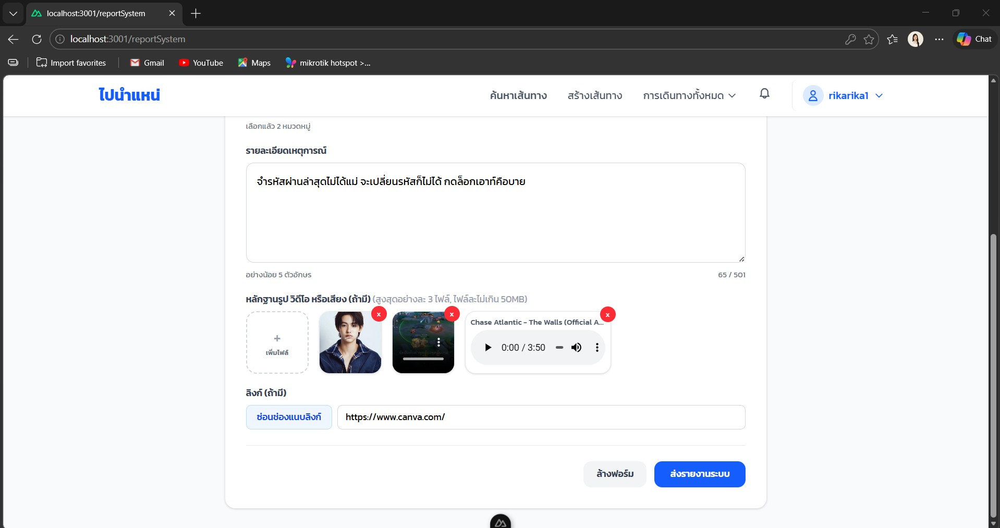

---

## 3.3 ส่งรายงานระบบ

- กดปุ่ม **"ส่งรายงานระบบ"** เพื่อยืนยันการส่ง
- กดปุ่ม **"ล้างฟอร์ม"** เพื่อล้างข้อมูลทั้งหมดในฟอร์ม

ระบบจะ:
- บันทึกรายงานพร้อมหลักฐานทั้งหมด
- กำหนดสถานะเริ่มต้นเป็น **รอดำเนินการ**
- บันทึกเข้าประวัติการรายงานของผู้ใช้งาน

---

# 4. รายงานหลังจบทริป (Post-Trip Report)

## 4.1 เข้าหน้าส่งรายงาน

1. ไปที่หน้า **คำขอจองเส้นทางของฉัน** (`/myRoute`)
2. เลือกรายการที่มีสถานะ **"จบทริปแล้ว"**
3. กดปุ่ม **"รายงานปัญหา"** ในรายการนั้น
4. ระบบจะแสดงฟอร์มรายงาน (Popup)

---

## 4.2 กรอกข้อมูลรายงาน

### ขั้นตอนที่ 1 — เลือกหัวข้อปัญหาที่พบ

เลือกได้มากกว่า 1 หัวข้อ:
- ปัญหาเกี่ยวกับรถ
- พฤติกรรมผู้โดยสาร
- การเดินทาง
- ความปลอดภัย
- การชำระเงิน
- อื่นๆ

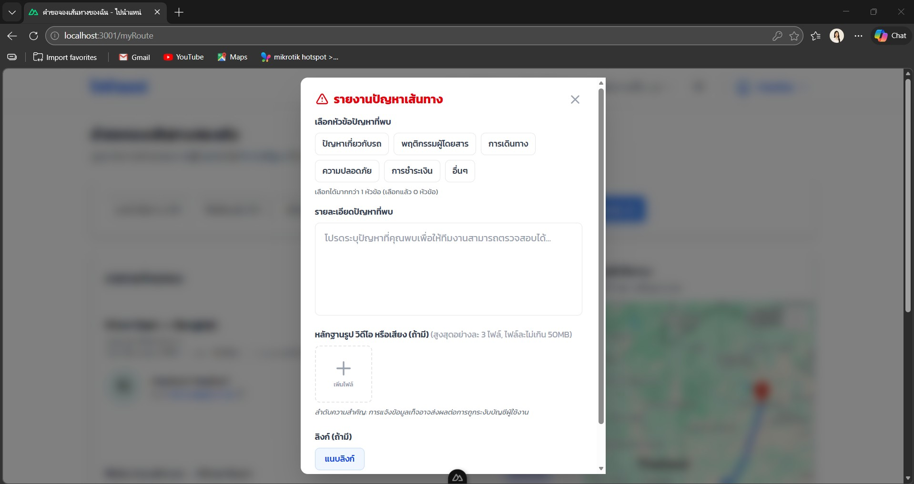

### ขั้นตอนที่ 2 — ระบุผู้โดยสารที่เกี่ยวข้อง (ถ้ามี)

หากเลือกหัวข้อที่เกี่ยวกับพฤติกรรมผู้โดยสาร ระบบจะแสดง dropdown ให้เลือกผู้โดยสารที่เกี่ยวข้องจากรายชื่อในเส้นทางนั้น

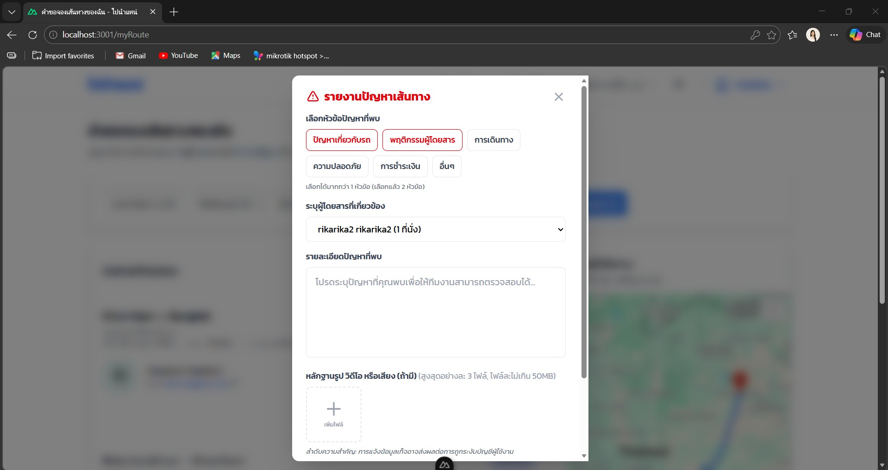

### ขั้นตอนที่ 3 — กรอกรายละเอียดปัญหา

อธิบายปัญหาในช่องข้อความ (รองรับสูงสุด 500 ตัวอักษร) เพื่อให้ทีมงานสามารถตรวจสอบได้

### ขั้นตอนที่ 4 — แนบหลักฐาน (ถ้ามี)

- **รูปภาพ / วิดีโอ / เสียง:** กดปุ่ม "เพิ่มไฟล์" แนบได้สูงสุด 3 ไฟล์ ขนาดไม่เกิน 50MB ต่อไฟล์
- **ลิงก์:** กดปุ่ม "แนบลิงก์" แล้วกรอก URL ที่เกี่ยวข้อง

> ⚠️ **คำเตือน:** การแจ้งข้อมูลเท็จอาจส่งผลต่อการถูกระงับบัญชีผู้ใช้งาน

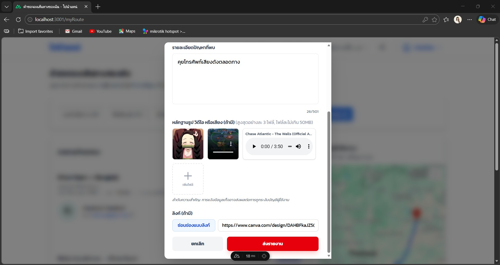

---

## 4.3 หลังจากกดส่งรายงาน

กดปุ่ม **"ส่งรายงาน"** เพื่อยืนยัน หรือกด **"ยกเลิก"** เพื่อปิดโดยไม่บันทึก

ระบบจะ:
- บันทึกรายงานพร้อมหลักฐานทั้งหมด
- กำหนดสถานะเริ่มต้นเป็น **รอดำเนินการ**
- เปลี่ยนปุ่มในรายการจาก "รายงานปัญหา" เป็น **"ดูสถานะรายงาน"**

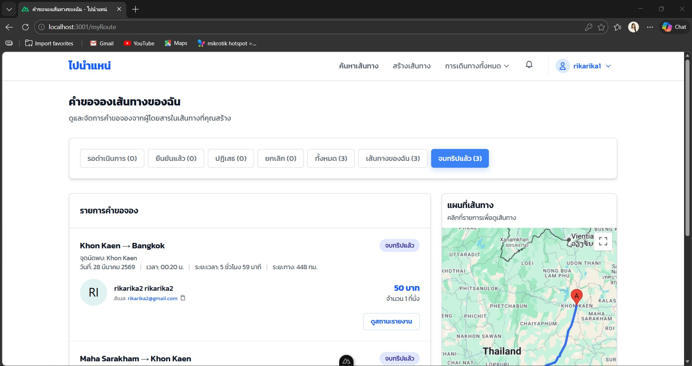

---

# 5. การติดตามสถานะรายงาน (จากหน้า My Route)

## 5.1 เข้าดูสถานะ

1. ไปที่หน้า **คำขอจองเส้นทางของฉัน**
2. หาการเดินทางที่เคยรายงานไว้ (ปุ่มจะเปลี่ยนเป็น "ดูสถานะรายงาน")
3. กดปุ่ม **"ดูสถานะรายงาน"**

---

## 5.2 หน้าติดตามสถานะรายงาน

ระบบจะแสดง dialog **"ติดตามสถานะรายงาน"** ประกอบด้วย:

**สถานะปัจจุบัน** แสดงด้วยไอคอนและข้อความ เช่น:
- 🕐 **รอการตรวจสอบ** — ทีมงานจะตรวจสอบคำร้องโดยเร็ว

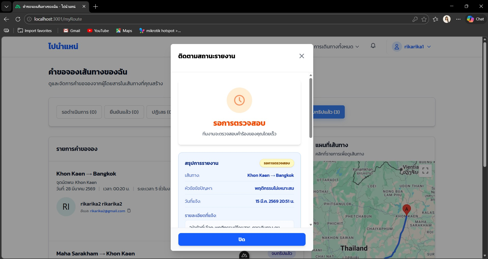

**สรุปการรายงาน** แสดงข้อมูล:
- ประเภทรายงาน และสถานะ
- เส้นทางที่รายงาน
- หัวข้อปัญหาที่เลือก
- วันที่แจ้ง
- รายละเอียดที่แจ้ง
- ลิงก์ที่แนบ (ถ้ามี)
- ไฟล์ประกอบ รูปภาพ/วิดีโอ/เสียง (ถ้ามี)

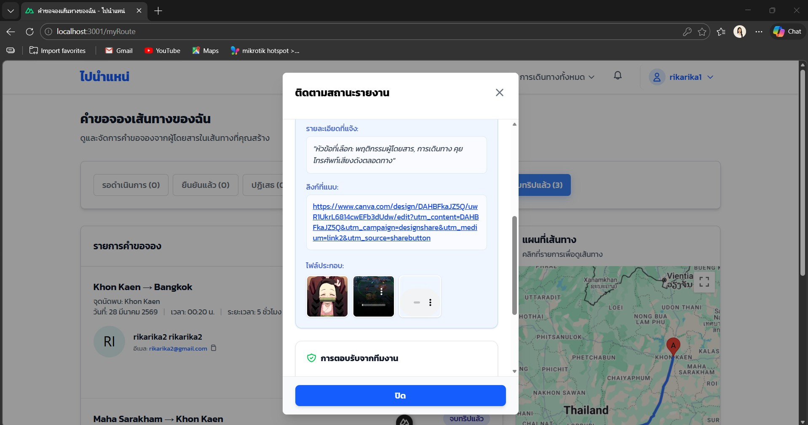

**การตอบรับจากทีมงาน** แสดงผลการพิจารณาเมื่อ Admin ดำเนินการแล้ว หากยังรออยู่ ระบบจะแสดงข้อความว่า "รายงานของคุณกำลังรอการตรวจสอบ เราจะเร่งดำเนินการให้เร็วที่สุด" พร้อมข้อมูลติดต่อ Admin

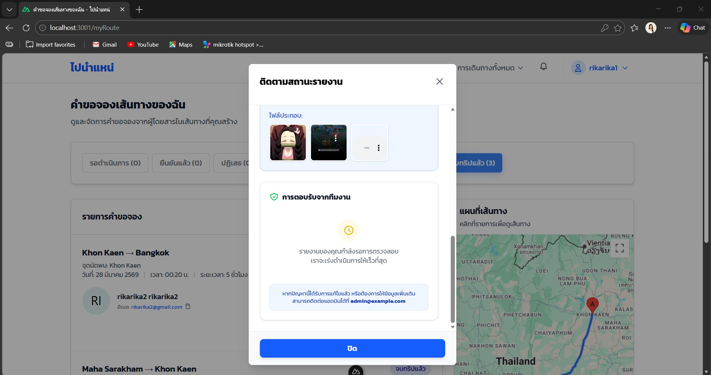

สถานะที่เป็นไปได้:
- **รอดำเนินการ** — รายงานถูกรับแล้ว รอ Admin ตรวจสอบ
- **กำลังตรวจสอบ** — Admin กำลังดำเนินการ
- **ตอบรับแล้ว** — Admin รับเรื่องและดำเนินการเสร็จสิ้น
- **ปฏิเสธ** — รายงานถูกปฏิเสธ

---

# 6. ประวัติการรายงานของฉัน

## 6.1 เข้าหน้าประวัติ

1. ไปที่ **โปรไฟล์และการตั้งค่า**
2. เลือกเมนู **ประวัติการรายงาน**
3. URL: `/profile/history-report`

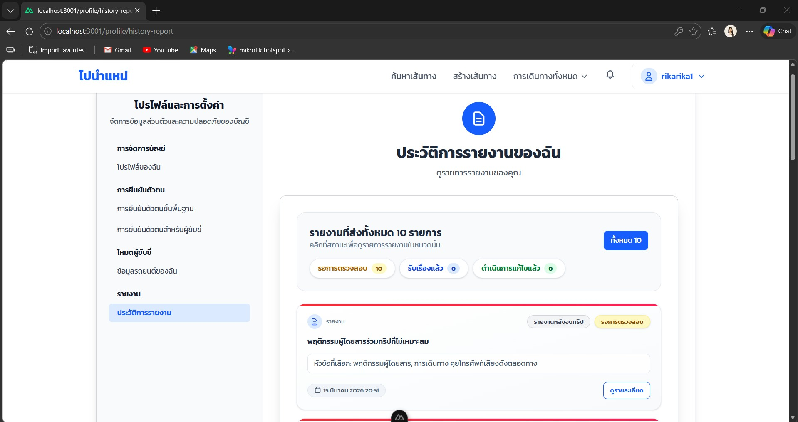

---

## 6.2 หน้าประวัติการรายงาน

ระบบแสดงภาพรวมรายงานทั้งหมดที่คุณเคยส่ง ประกอบด้วย:

**สรุปจำนวนรายงาน** แยกตามสถานะ:
- รอการตรวจสอบ
- รับเรื่องแล้ว
- ดำเนินการแก้ไขแล้ว

**รายการรายงานแต่ละรายการ** แสดง:
- ประเภทรายงาน (เช่น รายงานหลังจบทริป / รายงานระบบ)
- หัวข้อปัญหาที่เลือก
- วันที่ส่งรายงาน
- สถานะปัจจุบัน
- ปุ่ม **"ดูรายละเอียด"**

---

## 6.3 ดูรายละเอียดรายงานจากประวัติ

กดปุ่ม **"ดูรายละเอียด"** ในรายการใดก็ได้ เพื่อเปิด dialog **"ติดตามสถานะรายงาน"** ซึ่งแสดงข้อมูลครบถ้วน ได้แก่ สถานะปัจจุบัน, ประเภทรายงาน, หัวข้อปัญหา, วันที่แจ้ง และรายละเอียดที่แจ้งไว้

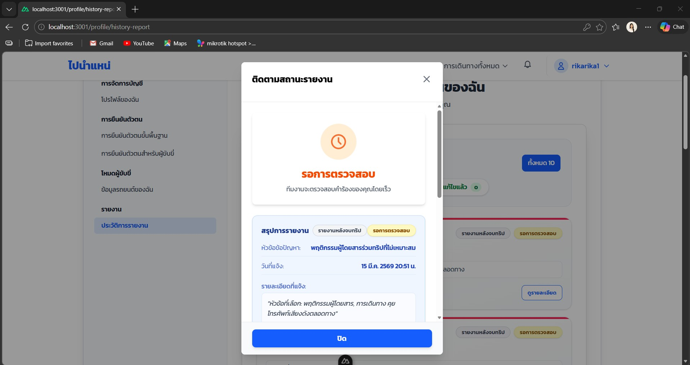

---

# 7. การทำงานของผู้ดูแลระบบ (Admin)

## 7.1 หน้า Check Report

Admin เข้าถึงได้ที่: `เมนู > Check Report` หรือ URL `/admin/reports`

**แดชบอร์ดสรุปรายงาน** ด้านบนแสดงจำนวนรายงานแยกตามประเภทปัญหาทั้งหมด ได้แก่ พฤติกรรมคนขับ, การเดินทาง, ปัญหาเกี่ยวกับรถ, การชำระเงิน, อื่นๆ, พฤติกรรมผู้โดยสาร, ความปลอดภัย, ปัญหาแอปพลิเคชัน, ปัญหาบัญชีผู้ใช้ และปัญหาเกี่ยวกับทริป

**ตารางรายการรายงาน** แสดงข้อมูลแต่ละรายการ:
- หมวดหมู่, ประเภทรายงาน, ผู้รายงาน, ผู้ถูกรายงาน, วันที่สร้าง, สถานะ
- ปุ่ม **"ตรวจสอบ"** สำหรับเปิดดูรายละเอียด

**ตัวกรอง** กรองตามสถานะ (รอดำเนินการ / กำลังตรวจสอบ / ตอบรับแล้ว / ปฏิเสธแล้ว) และประเภทรายงาน (รายงานระบบ / รายงานหลังจบทริป)

---

## 7.2 การตรวจสอบรายงานหลังจบทริป

กดปุ่ม **"ตรวจสอบ"** จะเปิด dialog **"ตรวจสอบรายงาน"** แสดงข้อมูล 2 ส่วน:

**ส่วนที่ 1 — ข้อมูลรายงาน:**
- ประเภทรายงาน และสถานะปัจจุบัน
- หมวดหมู่ และวันที่สร้าง
- ชื่อและอีเมลผู้รายงาน
- ชื่อและอีเมลผู้ถูกรายงาน (ถ้ามี)
- ลิงก์ดูเส้นทางที่เกี่ยวข้อง

**ส่วนที่ 2 — รายละเอียดการรายงาน:**
- หมวดหมู่ที่เลือกทั้งหมด พร้อมรายละเอียดปัญหา
- ลิงก์หลักฐาน (ถ้ามี)
- ไฟล์แนบรูปภาพ, วิดีโอ หรือเสียง พร้อม player สำหรับเปิดดูได้ทันที

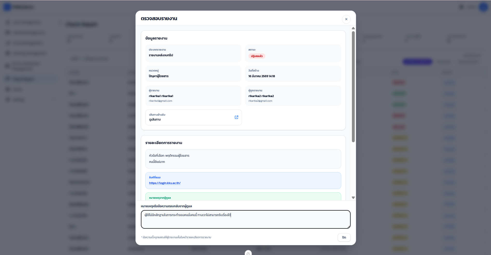

---

## 7.3 การตรวจสอบรายงานระบบ

รายงานระบบจะแสดงข้อมูลเพิ่มเติม ได้แก่ หมวดหมู่ที่เลือก รายละเอียดปัญหา และไฟล์แนบ (รูปภาพ/วิดีโอ/เสียง) พร้อม player เปิดดูได้ทันที

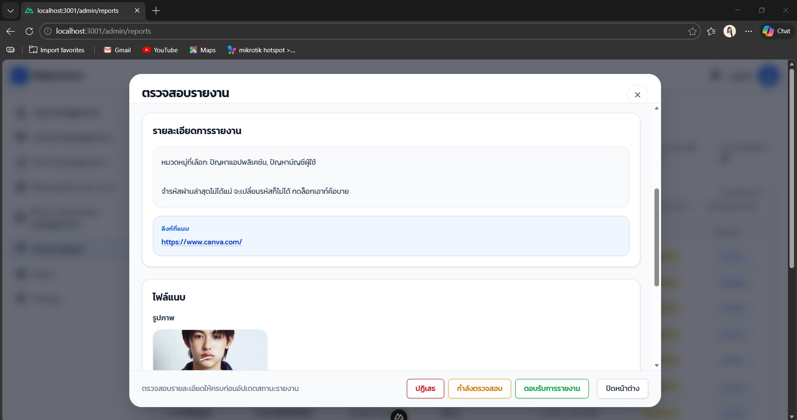

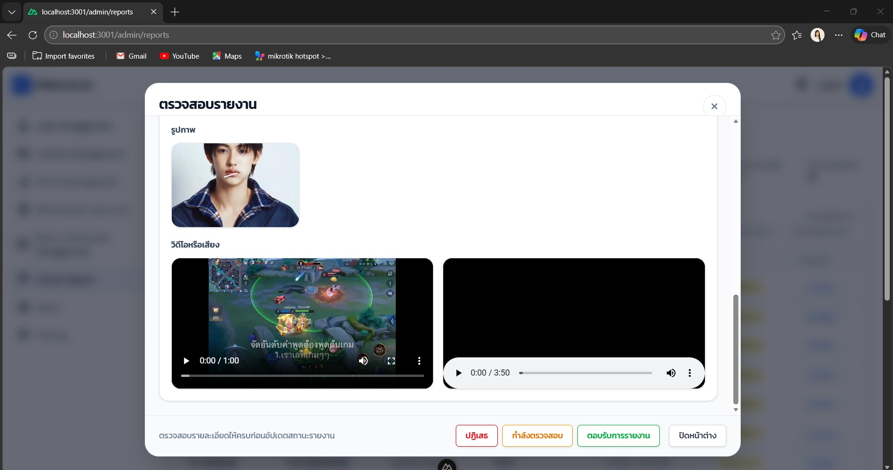

---

## 7.4 การเพิ่มหมายเหตุตอบกลับ

ใน dialog ตรวจสอบรายงาน Admin สามารถกรอกข้อความในช่อง **"หมายเหตุหรือข้อความตอบกลับจากผู้แล**" เพื่อแจ้งผลการพิจารณาให้ผู้รายงานทราบ

> ข้อความนี้จะถูกส่งให้ผู้รายงานเห็นในหน้าสถานะรายงานของตนเอง

---

## 7.5 การอัปเดตสถานะรายงาน

หลังตรวจสอบรายละเอียดครบแล้ว Admin เลือกดำเนินการด้วยปุ่มด้านล่าง dialog:

| ปุ่ม | การกระทำ |
|-----|----------|
| **ปฏิเสธ** | ปฏิเสธรายงาน |
| **กำลังตรวจสอบ** | ระบุว่ากำลังอยู่ระหว่างตรวจสอบ |
| **ตอบรับการรายงาน** | รับเรื่องและดำเนินการแล้ว |
| **ปิดหน้าต่าง** | ปิดโดยไม่เปลี่ยนสถานะ |

ระบบจะ:
- บันทึกสถานะใหม่พร้อมหมายเหตุ
- อัปเดตข้อมูลในตาราง
- แจ้งผลให้ผู้ใช้งานผ่านหน้าติดตามสถานะและประวัติการรายงาน

> ⚠️ **หมายเหตุ:** ตรวจสอบรายละเอียดให้ครบถ้วนก่อนอัปเดตสถานะทุกครั้ง

---

# 8. โครงสร้างข้อมูลรายงาน

ข้อมูลที่ระบบบันทึกในแต่ละรายงาน:

- ประเภทรายงาน (รายงานระบบ / รายงานหลังจบทริป)
- ประเภทผู้รายงาน (คนขับ / ผู้โดยสาร)
- หมวดหมู่ปัญหา (เลือกได้หลายหมวด)
- สถานะ (ค่าเริ่มต้น: รอดำเนินการ)
- รายละเอียดปัญหา
- ไฟล์หลักฐาน (รูปภาพ / วิดีโอ / เสียง)
- ลิงก์หลักฐาน (ถ้ามี)
- ข้อมูลเส้นทาง / การจองที่เกี่ยวข้อง (ถ้ามี)
- ผู้ถูกรายงาน (ถ้ามี)
- หมายเหตุจาก Admin (ถ้ามี)
- วันที่สร้างและวันที่แก้ไขล่าสุด
- ผู้ดูแลระบบที่ดำเนินการ (ถ้ามี)

---

# 9. เงื่อนไขความถูกต้องของระบบ (Acceptance Criteria)

ระบบจะถือว่าทำงานถูกต้องเมื่อ:

- ผู้ใช้งานส่งรายงานระบบได้สำเร็จผ่าน `/reportSystem`
- ผู้ขับขี่ส่งรายงานหลังจบทริปได้สำเร็จพร้อมหลักฐาน
- ระบบเปลี่ยนปุ่ม "รายงานปัญหา" เป็น "ดูสถานะรายงาน" หลังส่งแล้ว
- ผู้ใช้งานดูได้เฉพาะรายงานของตนเองในประวัติ
- Admin สามารถดูรายงานทั้งหมด เพิ่มหมายเหตุ และเปลี่ยนสถานะได้
- หมายเหตุจาก Admin แสดงให้ผู้รายงานเห็นในหน้าติดตามสถานะ
- ประวัติรายงานทั้งหมดแสดงในหน้า `/profile/history-report`

---

# 10. ปัญหาที่พบบ่อย (Troubleshooting)

**ส่งรายงานระบบไม่ได้:**
- ตรวจสอบว่าเลือกหัวข้อปัญหาแล้ว
- ตรวจสอบว่ากรอกรายละเอียดอย่างน้อย 5 ตัวอักษร

**มองไม่เห็นปุ่ม "รายงานปัญหา":**
- ปุ่มจะแสดงเฉพาะในรายการที่มีสถานะ "จบทริปแล้ว" เท่านั้น

**สถานะไม่อัปเดต:**
- รีเฟรชหน้า แล้วกดดูสถานะรายงานอีกครั้ง
- หากยังไม่อัปเดต รอ Admin ดำเนินการและตรวจสอบใหม่ภายหลัง

**ไฟล์แนบอัปโหลดไม่ได้:**
- ตรวจสอบขนาดไฟล์ว่าไม่เกิน 50MB ต่อไฟล์
- ตรวจสอบว่าแนบไม่เกิน 3 ไฟล์

---

# 11. บันทึกการเปลี่ยนแปลง (Change Log)

เวอร์ชัน 1.0
- เพิ่มระบบรายงานระบบ (`/reportSystem`) สำหรับผู้ใช้ทุกประเภท
- เพิ่มระบบรายงานปัญหาหลังจบทริปสำหรับผู้ขับขี่
- เพิ่มระบบแนบหลักฐาน (รูปภาพ / วิดีโอ / เสียง / ลิงก์)
- เพิ่มหน้าติดตามสถานะรายงาน
- เพิ่มหน้าประวัติการรายงานพร้อมดูรายละเอียด
- เพิ่มระบบ Check Report สำหรับ Admin
- เพิ่มระบบหมายเหตุตอบกลับจาก Admin
- เพิ่มระบบอัปเดตสถานะโดย Admin

---

# 12. การประกาศการใช้ AI

เอกสารฉบับนี้มีการใช้เครื่องมือ AI ในการช่วยจัดรูปแบบเอกสาร
โดยเนื้อหา การออกแบบ และการพัฒนาระบบดำเนินการโดยทีมผู้พัฒนาโครงการ
